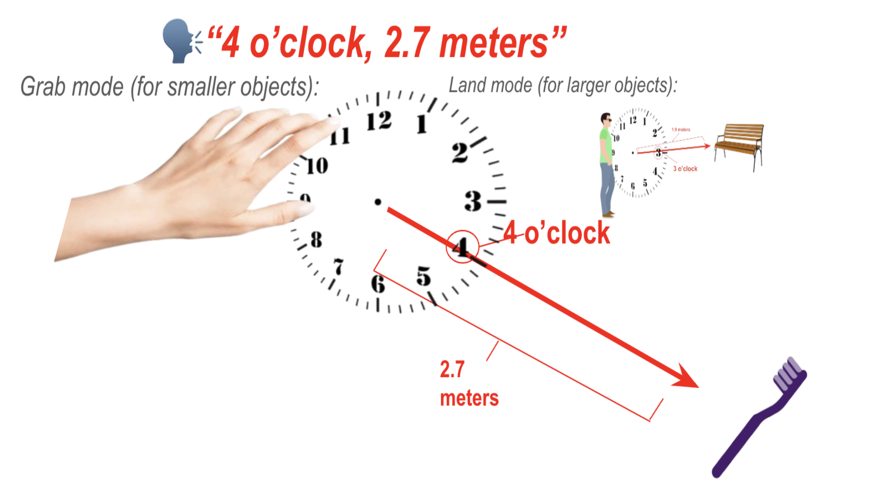

# Object Detection and Localization Sight to Sound
Framework for Visually Impaired Community
[**Finding Buddy**] (findingbuddy.ai)

## Overview
**Finding Buddy** is an innovative assistive device designed to aid visually impaired (VI) individuals in locating specific objects within their environment. Finding Buddy is leveraging advanced technologies such as VOSK-API for speech recognition and YOLOv8 for object detection, as well as novel methods such as the Hand Relative Directioning System and the Rotated Military Clock Directioning System. Finding Buddy offers a user-friendly solution that enhances the independence and quality of life for VI users. This repository contains the implementation and supporting files for the Finding Buddy system.
    
[**Research Paper**](google.com) &nbsp; [**Video Demonstration**](https://www.youtube.com/watch?v=zEVl4kBO3d4) 


## Rotated Military Clock Directioning System
The format of the audio given directions is perhaps the most vital element of the user experience, because it is the deciding factor for product usability and user receptiveness/precision. However, we are not providing directioning on a 2D plane like most assistive devices currently in the market (e.g. navigation) but rather on a 3D space, because objects may be up and down in addition to forward, back, left and right. For this purpose we had to developed a completely new format for the directioning system, the rotated military clock directioning system, where degrees are given (see Figure 1).

## Hand Relative Directioning System
A novel feature was developed where the program can provide directioning relative to the hand, which is especially useful for smaller objects. The VI user may want to grab a fork, bottle, or toothbrush with their hand, while larger objects do not need hand relative directioning, e.g. bench, bus, or car. This is the first instance of hand relative directioning in VI assistive technology. 

<sup>Figure 1: Diagram of the novel directioning system. Shown bigger on the left is the grab mode, and smaller on top right is the land mode. Audio given results are the clock degrees in addition to the forward distance in meters.</sup>


## Installation
To set up Finding Buddy, follow these steps:

1. **Clone the Repository**:
    ```bash
    git clone https://github.com/SaudAlzahri/findingbuddy.git
    
     # Create Environment (Optional)
    python3 -m venv venv
    # macOS
    source ./venv/bin/activate
    # Windows
    venv/Scripts/activate
    # Anaconda
    conda create -n venv python==3.11
    
    cd findingbuddy

    ```

3. **Install Dependencies**:
    ```bash
         # NOTE FOR MACOS USERS: Uncomment PyObjC (in requirements.txt) if running macOS
    pip3 install -r requirements.txt
    ```

4. **Connect your smartphone's camera as input**: *(You may skip this step and use your laptop webcam.)*

   To use your smartphone's camera as the input for the Finding Buddy device, you will use Iriun Webcam:

    On Your Smartphone:
   
    1. Install **Iriun Webcam** using Google Play Store for Android or App Store for iOS.
    
    On Your Computer:
   
    2. Go to the [Iriun Webcam website](https://iriun.com/).
   
    3. Download the software for **Windows** or **macOS**, depending on your operating system.
    
    4. Ensure that your computer and smartphone are connected to the **same Wi-Fi network**.

    5. **Wait for connection**: Your smartphone’s camera feed should automatically appear in the Iriun Webcam software on your computer.
  
    NOTE: Once Iriun's software displays the connection, it automatically designates the camera feed as the first in the camera index (int 0), which is why we assign int 0 in main.py line 51 (below). In some cases it can get assigned to a different number in the camera index, so you would change int 0 to 1 or 2.

   ```vid = cv2.VideoCapture(0)  # Value 0 should default to Iriun Webcam, otherwise try 1 or 2```
6. **Run the Application**:
    ```bash
    python3 main.py
    ```

## Files
- `main.py`: Main script to run the Finding Buddy application, beginning with audio input.
- `object.py`: Function handling visual input and post visual input algorithms.
- `requirements.txt`: List of required Python packages.
- `texttovoice.py`: Script containing gTTS's HTML text to voice function.
- `clock.py`: Algorithm achieving the rotated military clock directioning system.
- `vosk-model-small-en-us-0.15/`: Directory containing VOSK-API's language model.
- `images/`: Directory for storing images used in the READ ME.

## Usage
1. **Run the Application**:
    Run the main file. Wait until initiation is completed in terminal.
    ```bash
    python3 main.py
    ```
3. **Voice Command**:
    Use voice commands to interact with the system, with all command following the initiation phrase "Finding Buddy." For example, say "Finding Buddy, find my bottle" to begin a search for your water bottle.
5. **Audio Guidance**:
    The device will provide audio instructions using the novel rotated military clock directioning system and forward distance in meters to guide you to the object: "9 o'clock, 2 meters." Were the object to be small (bottle) the novel hand-relative directioning system would provide directioning to move your hand, however were it to be large (couch) it would provide directioning to move your body.

## Documentation
Drive link to the scientific research paper:
&nbsp;[**Research Paper**](google.com)

Youtube link to filming of testing and validation process: &nbsp; [**Video Demonstration**](https://www.youtube.com/watch?v=zEVl4kBO3d4)

## License
This project is licensed under the MIT License. See the `LICENSE` file for details.

---

